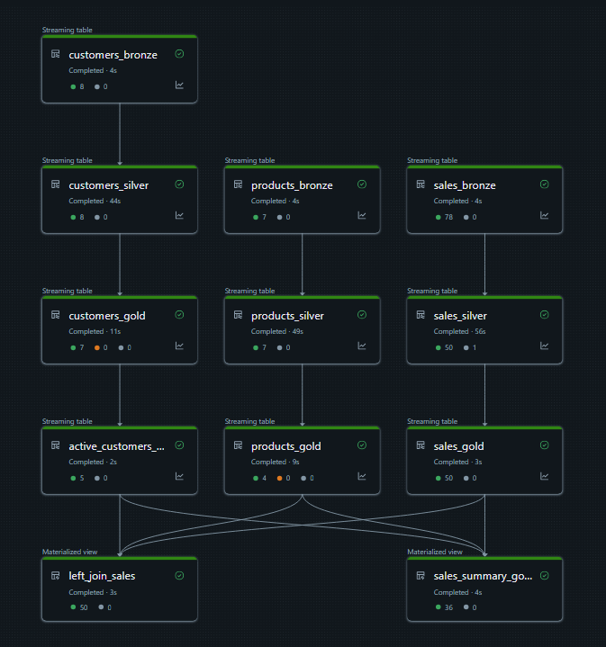

## Automated SQL Based DLT Pipeline
 

### **Overview**
This project demonstrates a comprehensive, production-ready data engineering pipeline built for an e-commerce use case featuring sales, product, and customer datasets. The pipeline is designed to handle real-time and batch data updates while maintaining high data quality and governance standards.

### **Tech Stack**
Databricks Delta Live Tables (DLT), PySpark, Spark SQL.

### **Description**

1. Raw Data Ingestion (Bronze Layer) - The pipeline ingests raw CSV files from cloud storage into streaming live tables using Autoloader.
2. Data Quality and Cleaning (Silver Layer) - Implemented DLT Expectations (constraints) to ensure data quality.
3. SCD Implementation (Gold layer) - Applied SCD Type 1 to products table to maintain current states and SCD Type 2 to customers table to preserve historical changes. Created a materialized views by joining product, sales & customer table.
4. Governance and Monitoring: All tables and views are managed through Unity Catalog, providing centralized access control and lineage tracking.
5. Created a scheduled trigger to automatically run the pipeline everyday.
 

